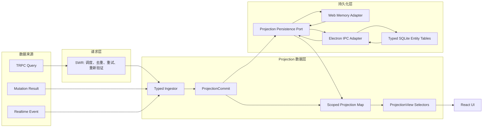
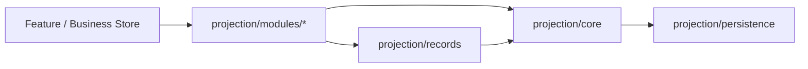
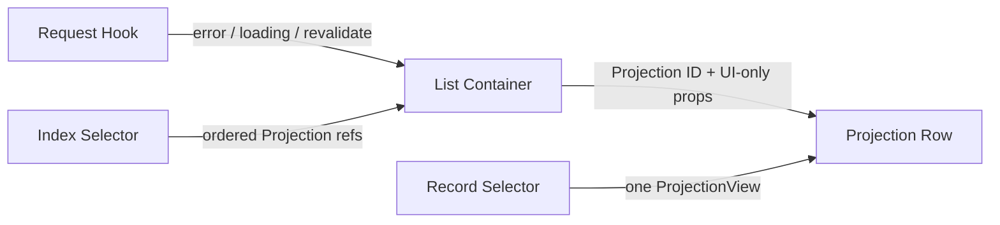
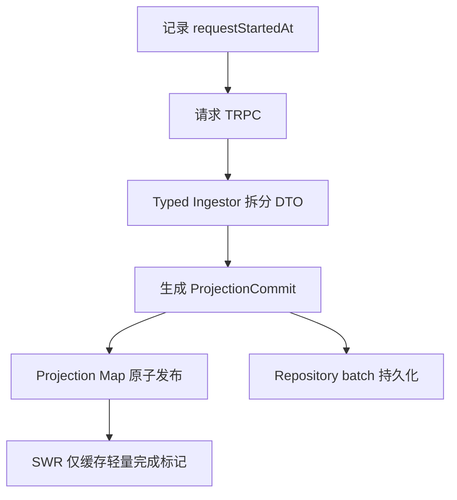
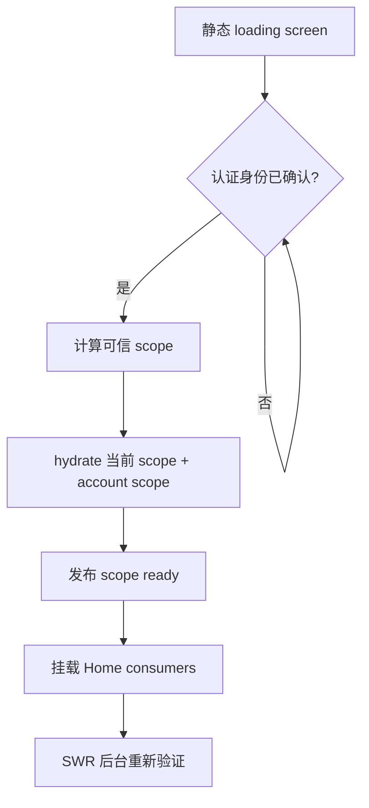

# Projection 客户端数据层与 Home 数据迁移规范

> 状态：第一阶段与跨运行时 Entity Cache 已实现\
> 首个落地范围：Home Dashboard 及其右侧 Inbox\
> 运行时后端：Web 进程内存 / Desktop typed SQLite Entity Cache

## 1. 背景

当前客户端主要以 SWR key 为缓存单元。部分 SWR 响应被直接持久化，启动时再按 key
恢复；同一业务实体还可能同时出现在 SWR、多个 Zustand Store、列表响应和嵌套 DTO 中。
该结构存在四类系统性问题：

1. **持久化语义依赖请求形态**：请求参数或 key 变化后，旧数据无法自然迁移，也难以判断
   哪些 key 已被遗漏。
2. **同一实体存在多个可写副本**：例如 Agent 同时存在于侧栏列表、Brief 的嵌套快照和
   Task participant 中。更新一个副本不能保证其他副本同步。
3. **列表与实体混合**：列表响应既承担顺序和成员关系，又重复保存实体字段，导致列表刷新
   可以覆盖更晚的实体更新。
4. **局部响应缺少显式完整性**：不同接口返回同一实体的不同字段，但现有类型无法表达
   “当前对象对哪个 UI 契约已经完整”。

本规范将 SWR 限定为请求调度器，并建立以局部投影、fragment、索引和快照为核心的客户端数据层。
Projection 只表达客户端已经观测并建模的字段，不表示完整业务实体，也不取代服务端事实源。

## 2. 目标与非目标

### 2.1 目标

- 每个 scope 内，同一种业务身份只存在一个可写的 canonical `ProjectionRecord`。
- 完整 DTO、局部 DTO、mutation 结果和实时事件统一转换为 `ProjectionCommit`。
- fragment 以整体为最小替换单元，不执行无来源语义的 `merge(Partial<Entity>)`。
- 列表只持有实体引用、顺序、成员关系、查询签名和 coverage，不持有实体副本。
- `ProjectionView` 明确表示 “满足某个已声明 View Contract 的完整视图”。
- 持久化以业务数据模型为单位，不以 SWR key 为单位。
- 已登录 warm reload 在认证确认后可直接使用本地 Projection 数据，并在后台重新验证。
- account/workspace scope 严格隔离，未经认证确认不得展示持久化的私有数据。

### 2.2 非目标

- 本轮不替换服务端 PostgreSQL、TRPC 或领域 Repository。
- 本轮不把 `localDatabase` 变成离线写队列；服务端仍是最终事实来源。
- 本轮不要求一次性迁移全仓库所有 Zustand Store。
- 本轮不持久化任意 SWR response，也不建立 SWR key 到实体表的隐式映射。
- 本轮不改变 Daily Brief 的服务端语义、日期边界或刷新策略。

## 3. 术语

| 术语             | 定义                                                                                      |
| ---------------- | ----------------------------------------------------------------------------------------- |
| Entity           | 具有稳定逻辑身份的领域对象，例如 Agent、Topic、Task、Brief。                              |
| Entity Kind      | 实体类型，例如 `agent`、`topic`。ID 只在 kind 内唯一。                                    |
| Scope            | 数据隔离边界，格式为 `${userId}:${workspaceId \| personal \| account}`。                  |
| ProjectionRecord | scope 内某个 kind/id 的唯一局部 fragment 容器；不承诺表示完整实体。                       |
| Fragment         | 字段所有权明确、能够被至少一个来源整体替换的一组字段。                                    |
| Index            | 某一查询的成员关系、顺序和上下文元数据；仅保存引用。                                      |
| Snapshot         | 没有稳定实体身份，或其语义本身就是一次计算结果的数据。                                    |
| View Contract    | 某个消费界面声明的必需 fragments 集合。                                                   |
| ProjectionView   | 以一个 root ProjectionRecord 为主体，可组合引用记录，并满足某个 View Contract 的完整值。  |
| Aggregate View   | 覆盖当前 registry 已建模 fragments 的可选视图；仍不代表服务端完整实体。                   |
| ProjectionCommit | 一次原子内存变更，包含 fragment replacements、index/snapshot replacements 和 tombstones。 |

## 4. 总体架构



### 4.1 代码分层与依赖方向

Projection 是客户端已获取字段的 canonical 投影基础设施，不是完整业务实体仓库，也不是与
Home、Chat、Task 并列的业务 Store。代码放在独立的 `src/projection` 顶层目录：

```text
src/projection/
├── core/                 # scope、commit reducer、hydration、通用校验
├── records/              # canonical Projection action、selector、validator
├── modules/
│   └── home/             # Home ingestor、Index、View selector、request hook
├── persistence/          # persistence port、Web memory、Electron codec/adapter
├── registry.ts           # 运行时适配器注册与稳定 forwarding facade
├── store.ts              # composition root；组合 core/records/modules
└── index.ts              # 面向消费者的公共入口

src/store/                # 各业务模块的 UI、交互和流程状态
packages/types/src/projection/
├── records/              # 按业务身份拆分的 fragments/records
└── modules/              # 按业务模块命名的 Index、Snapshot、View 类型
```

依赖必须遵守以下方向：



- `core` 不得依赖 Home、Chat、Task 等业务模块。
- concrete repository 由 composition root 注入 `core`；`core` 不得通过 persistence 反向加载
  任何业务 validator。
- canonical record 按实体命名，例如 `AgentProjection`、`TopicProjection`；不得使用
  `HomeAgentRecord` 之类的 feature-scoped 名称。
- Home 语义仅允许出现在 `home.*` Index、Home Snapshot、View Contract、Ingestor 和请求 Hook。
- `src/store/*` 可以向 Projection 提交 mutation commit，但不得成为 canonical Projection source。
- 新业务模块接入时扩展 Projection Record/Index/Snapshot registry，不创建第二个 projection map。

### 4.2 React 订阅边界

Projection Graph 的规范化不能止于 Store 内部；React 消费方式同样属于架构契约：



- Request Hook 只负责请求编排和 coverage 状态，不返回实体数组或聚合 `ProjectionView`。
- 列表容器只订阅对应 Index，并向行组件传递 Projection ID/ref 与事件回调等 UI 参数。
- 行组件按 ID 订阅自己的 ProjectionRecord，并在本地组装对应 `ProjectionView`。
- 祖先组件不得把实体数组、完整 read model 或 ProjectionStore 实例作为 props 逐层传递。
- Selector 必须订阅所需的精确 Index、Record 或 fragment；不得为了组装一个列表而订阅整个
  `state.scopes[scope]`。
- Store 不保存预组装的 `ProjectionView[]`。Index、Record 更新后，Selector 是唯一的视图组装入口。
- Snapshot 的值本身是一个原子计算结果，可以由直接消费它的组件整体订阅；该例外不适用于
  具有稳定实体身份的集合。

该边界保证一个 Agent、Topic、Task 或 Brief 更新时，只重新渲染消费该记录的行，而不是让
Home 根节点重新组装并下发整个列表。

### 4.3 运行时职责

| 层               | 负责                                              | 不负责                           |
| ---------------- | ------------------------------------------------- | -------------------------------- |
| SWR              | 请求触发、in-flight 去重、重试、错误、重新验证    | canonical 数据、持久化、实体合并 |
| Ingestor         | 将具体 DTO 显式拆为 fragments、indexes、snapshots | 网络调度、UI 状态                |
| Projection Map   | scope 内唯一局部记录、commit 冲突处理、原子发布   | 远端事实存储、完整实体建模       |
| View Selector    | 检查 coverage 并组装不可写视图                    | 保存第二份 Projection 数据       |
| Persistence Port | 为 Store 提供统一 commit、hydrate、clear API      | 暴露 Web/Electron 分支给业务层   |
| Web Adapter      | 当前页面生命周期内的进程内存缓存                  | durable warm reload、离线事实源  |
| Electron Adapter | IPC codec、同 scope 写入排序                      | fragment 合并、UI 状态           |
| SQLite Entity DB | typed entity/index/snapshot 表、事务与约束        | 服务端事实存储、任意 KV          |

## 5. 身份与 scope

Projection record 的存储身份为：

```text
(scope, projectionKind, id)
```

- Personal scope：`${userId}:personal`。
- Workspace scope：`${userId}:${workspaceId}`。即使 workspace 相同，不同用户的成员视图仍需隔离。
- Account-wide 数据（当前为 Daily Brief）使用独立的 `${userId}:account` 分区，避免同一用户
  切换 workspace 时因为请求 key 不变而落入未填充的 workspace snapshot 分区，也避免为了
  一份 account snapshot 而加载完整 personal scope。
- Anonymous scope 不持久化 Home 私有 Projection。
- `lobehub:active-scope` 仅可用于提前定位候选分区，不能作为认证证明。
- Web 必须等待 auth session settled；Desktop 必须等待 `isUserStateInit`。只有确认后的 scope
  可以提交或展示私有 Projection 数据。Web hydration 通常为空；Desktop 可从实体表恢复。

## 6. ProjectionRecord 与 fragment 规则

概念类型如下：

```ts
interface ProjectionFragment<T> {
  data: T;
  observedAt: number;
  source: 'network' | 'mutation' | 'realtime';
}

interface ProjectionRecord<K extends string, F extends Record<string, unknown>> {
  fragments: { [P in keyof F]?: ProjectionFragment<F[P]> };
  id: string;
  kind: K;
  tombstoneAt?: number;
}
```

fragment 必须满足：

1. 至少有一个来源能够一次返回该 fragment 的全部字段。
2. 更新时整体替换，不对 fragment 内字段做通用 partial merge。
3. 如果某接口只能返回现有 fragment 的一部分，应拆出更小、所有权更明确的 fragment。
4. `undefined` 表示来源未覆盖；`null` 表示来源明确给出的空值，两者不可混用。
5. 完整 DTO 进入数据层时，必须由领域 Ingestor 拆为所有已建模 fragments；不得保留一份
   opaque raw DTO 作为并行事实来源。

## 7. 冲突与时序

每次请求在发出前记录 `observedAt`，而不是在响应返回后记录。fragment replacement 仅在以下
条件之一成立时接受：

- 当前 fragment 不存在；
- incoming `observedAt` 大于当前值；
- 时间相等且来源优先级更高。

同一时间的来源优先级为：

```text
mutation > realtime > network
```

这样可以避免 “早发出的慢请求” 在 mutation 或实时事件之后返回，并把新状态覆盖为旧状态。
当服务端未来提供 revision/version 时，应优先比较服务端 revision；`observedAt` 是当前兼容策略。

删除以 tombstone 表达。早于 tombstone 的 fragment 或 index 响应不得复活实体；晚于 tombstone
且明确重新创建的响应可以替换 tombstone。

## 8. Index 与 Snapshot

### 8.1 Index

Index 只能保存：

- Projection refs；
- 有序成员关系；
- 分组关系；
- 查询签名；
- query-specific 元数据，例如 sidebar pin、unread count；
- coverage 和 `observedAt`。

Index 不得嵌入 Agent、Topic、Task 或 Brief 对象。成员被列表移除不等于 Projection 被删除。

### 8.2 Snapshot

以下数据保留为 snapshot：

- Daily Brief 推荐 pair；
- 推荐 feed；
- 其他一次计算结果且没有稳定实体 ID 的 payload。

Snapshot 仍然是 typed、versioned、scoped 的持久化对象，但不参与 Projection Map 去重。

## 9. ProjectionView 完整性

`ProjectionView` 不是 “数据库表所有字段的完整实体”，而是 “对一个声明过的 View Contract 完整”。

示例：

| View Contract          | 必需 fragments                                                                                 |
| ---------------------- | ---------------------------------------------------------------------------------------------- |
| `HomeSidebarAgentView` | Agent `identity`、`profile`、`access`、`routing`、`runtime` + sidebar index context            |
| `HomeRecentTopicView`  | Topic `display`、`activity`、`routing`、`navigation`                                           |
| `HomeInboxTopicView`   | Topic `display`、`activity`、`routing`、`status`、`runTiming`、`preview`                       |
| `HomeTaskCardView`     | Task `identity`、`display`、`description`、`lifecycle`                                         |
| `HomeBriefCardView`    | Brief `content`、`actions`、`readState`、`resolution`、`relations`；Agent/Task enrichment 可选 |

Selector 必须先验证必需 fragments。若缺失，返回未满足 coverage 的结果，不使用类型断言伪造完整
对象。对可选关联 Projection 缺失时，只能省略 enrichment，不能把整个主 Projection 判为不完整。

## 10. Home 第一阶段数据模型

### 10.1 Projection Records

| Kind      | Fragment      | 字段责任                                                 |
| --------- | ------------- | -------------------------------------------------------- |
| Agent     | `identity`    | title、avatar、backgroundColor                           |
| Agent     | `profile`     | description、slug                                        |
| Agent     | `access`      | userId、visibility                                       |
| Agent     | `routing`     | sessionId                                                |
| Agent     | `runtime`     | heterogeneousType                                        |
| ChatGroup | `identity`    | title、avatar、groupAvatar、backgroundColor、description |
| ChatGroup | `access`      | userId、visibility                                       |
| Topic     | `display`     | title                                                    |
| Topic     | `activity`    | updatedAt                                                |
| Topic     | `creation`    | createdAt                                                |
| Topic     | `routing`     | agentId                                                  |
| Topic     | `navigation`  | routePath                                                |
| Topic     | `status`      | status                                                   |
| Topic     | `runTiming`   | runStartedAt                                             |
| Topic     | `preview`     | lastAssistantMessage、trigger、userId                    |
| Task      | `identity`    | identifier                                               |
| Task      | `display`     | name                                                     |
| Task      | `description` | description                                              |
| Task      | `lifecycle`   | status                                                   |
| Task      | `assignment`  | assigneeAgentId、participants、visibility、workspaceId   |
| Brief     | `content`     | title、summary、type、priority、createdAt、artifacts     |
| Brief     | `actions`     | actions                                                  |
| Brief     | `readState`   | readAt                                                   |
| Brief     | `resolution`  | resolvedAt、resolvedAction、resolvedComment              |
| Brief     | `relations`   | agentId、taskId、topicId、cronJobId、userId              |

Brief 响应中的嵌套 Agent 和 Task 字段不会留在 Brief record 内：它们分别写入 Agent/Task
fragments，`HomeBriefCardView` 再从引用组装 enrichment。

### 10.2 Indexes

| Index                   | 内容                                                                                  |
| ----------------------- | ------------------------------------------------------------------------------------- |
| `home.sidebar`          | pinned/private/grouped/ungrouped 的 Projection refs、folder 元数据、pin/unread 上下文 |
| `home.recentTopics`     | 有序 Topic refs，以及本次查询覆盖的 `limit`                                           |
| `home.inboxTopics`      | 有序 Topic refs，查询签名为 running + unread + last message                           |
| `home.tasks`            | 有序 Task refs、total、查询签名为 all agents + all visibility                         |
| `home.unresolvedBriefs` | 有序 Brief refs                                                                       |

### 10.3 Snapshots

| Snapshot          | 语义                                                                 |
| ----------------- | -------------------------------------------------------------------- |
| `home.dailyBrief` | 存于 account scope；保持现有服务端返回与刷新语义，不增加本地日期 key |

### 10.4 暂不进入本轮 canonical graph 的数据

| 数据                     | 原因与后续                                                                |
| ------------------------ | ------------------------------------------------------------------------- |
| Auth/User session        | 认证事实不能从本地实体缓存恢复；继续由 auth/user Store 管理               |
| Workspace member profile | 当前已有独立 workspace hook；后续迁移为 UserProjection + membership index |
| Recommendations          | 独立 snapshot，非 Home 首屏正确性的阻塞项                                 |
| Document recents         | 当前 Dashboard 只请求 topic；全局 Recents 迁移时加入 DocumentProjection   |

## 11. Typed Repository 与物理布局

业务层只依赖 `ProjectionPersistence`，由 composition root 在首屏渲染前选择实现：

| Runtime  | 实现                            | 语义                                                     |
| -------- | ------------------------------- | -------------------------------------------------------- |
| Web      | `MemoryProjectionPersistence`   | 页面生命周期内可复用；刷新后允许重新加载，不写 IndexedDB |
| Electron | `ElectronProjectionPersistence` | 通过独立 IPC 写 typed SQLite；支持 durable warm reload   |

业务 Action、Selector、Ingestor 和组件禁止判断运行时。二者共同使用 `ProjectionCommit`、
Fragment 冲突规则与 hydration API，差异只存在于 persistence adapter 以下。

Electron 物理布局不是通用 KV，而是固定 registry 的实体 read model：

| SQLite table                | 主身份               | 固定内容                                          |
| --------------------------- | -------------------- | ------------------------------------------------- |
| `projection_agents`         | `(scope, entity_id)` | access/identity/profile/routing/runtime fragments |
| `projection_chat_groups`    | `(scope, entity_id)` | access/identity fragments                         |
| `projection_topics`         | `(scope, entity_id)` | 当前 Topic registry 的八个 fragments              |
| `projection_tasks`          | `(scope, entity_id)` | 当前 Task registry 的五个 fragments               |
| `projection_briefs`         | `(scope, entity_id)` | 当前 Brief registry 的五个 fragments              |
| `projection_home_indexes`   | `(scope, key)`       | 五个受约束的 `home.*` index                       |
| `projection_home_snapshots` | `(scope, key)`       | 受约束的 `home.dailyBrief` snapshot               |

每个实体 Fragment 对应固定的 `*_data / *_observed_at / *_source` 三列。SQLite 约束保证：

- 三列同时为空或同时存在；
- `observed_at >= 0`；
- source 只能为 `network / realtime / mutation`；
- data 是合法 JSON；
- schema version、index key、snapshot key 只能取当前 registry 允许值。

Fragment data 使用 SuperJSON 保留 Date 等结构化类型；hydration 后仍必须运行 Record、Index、
Snapshot 领域 validator，无效行按 cache miss 处理。一次 materialized commit 的实体、index、
snapshot 在同一 SQLite transaction 内 upsert；renderer 内同一 scope 的 IPC commit 保持调用
顺序，主进程再串行化共享 SQLite 连接上的所有写事务。

SQLite schema 变化必须新增 Desktop local migration，不修改已发布 migration。Entity Cache 是可
重建 read model；不为旧 `entity-records / entity-indexes / entity-snapshots` KV 行编写业务回填，
网络重新验证会重建新表。

## 12. 请求与 SWR 协议

Home 请求 hook 使用非持久化的 request key。Fetcher 流程如下：



约束：

- UI 不读取 SWR response 作为数据源，只读取 ProjectionView selector。
- 请求 Hook 不读取或返回 ProjectionView；请求状态与事实数据 selector 必须分离。
- Fetcher 在写入 Projection Graph 后只向 SWR 返回轻量 request marker，不把 DTO 留在 SWR cache。
- SWR error 表示本次重新验证失败；若 index 已 hydration，UI 保留 stale ProjectionView。
- `mutate()` 只负责重新触发请求，不负责手工维护实体副本。
- Home request key 不加入 `CACHE_TIERS`。
- Provider hydration 只恢复当前仍属于持久化 tier 的 key；从 tier 移除的旧行会被清理，避免
  已退役的 Brief/Home DTO 在后续启动中继续进入 SWR 内存。

## 13. 启动、hydration 与 scope 切换

首次启动顺序：



- 初次 hydration 失败时，发布空的 ready scope，并依赖网络恢复，不能永久阻塞应用。
- Web adapter 不承诺跨刷新 hydration；Electron adapter 从 typed SQLite 表恢复。
- hydration 得到的空 index 仍表示 “已初始化且结果为空”；index 缺失才表示从未取得 coverage。
- scope 切换不得展示前一 scope 的数据。Selector 始终显式接收当前 scope。
- 已在内存准备完成的目标 scope 可立即切换。
- 尚未准备完成时，当前实现只允许目标 Home surface 显示局部 loading；后续 workspace
  切换控制器应采用 `prepare(target) -> commit active workspace` 的两阶段协议，从而消除此窗口。

## 14. Mutation 与实时事件

Mutation 不得分别 patch SWR、Zustand list 和组件本地状态。统一流程为：

1. 构造 mutation `ProjectionCommit`，替换明确 fragment 或 index。
2. 原子更新 Projection Graph，并写入 typed repository。
3. 发起服务端 mutation。
4. 成功后按返回值提交 authoritative commit，或触发对应 request revalidation。
5. 失败时以 inverse commit 回滚，或重新读取服务端事实。

本轮至少接入以下更新路径：

- Brief read/resolve/delete；
- Topic title/status；
- Task status；
- Home inbox 的 `promoteToRunning`；
- Recent topic title。

## 15. Projection 与业务 Store 的迁移边界

新的 Projection Graph 是 Home Dashboard 的 canonical read source。既有 Store 按以下原则过渡：

- Home 新 UI 不再以 BriefStore/TaskStore/SWR response 为 canonical data。
- 既有 Store 可以暂时保留页面级编辑状态、mutation 状态和旧消费者。
- 兼容写路径必须同时转换为 Projection commit；不得新增反向的 Projection → SWR 数据镜像。
- 旧 Store 中的列表 DTO 属于迁移期 projection，不得被新的 Home 代码直接消费。
- 兼容 projection 可以通过 Store 的非 React subscription 更新；不得要求新组件订阅聚合
  ProjectionView 来驱动该 projection。
- Agent 列表仍有非 Home 旧消费者，因此保留一个由 `HomeSidebarAgentView` 单向生成的只读
  HomeStore projection；它不自行请求、不接受未建模字段写入，并在 scope 改变且目标
  ProjectionView 尚未准备完成时于浏览器绘制前清空。
- 后续迁移完成后删除相应 projection 字段和 SWR 持久化规则。

## 16. 错误、加载与 stale 语义

| 本地 coverage                  | 网络状态     | UI 行为                                     |
| ------------------------------ | ------------ | ------------------------------------------- |
| 有完整 index/view              | 请求中或失败 | 立即显示 stale data；错误为非阻塞刷新错误   |
| 有空 index                     | 请求中或失败 | 显示真实 empty state，不显示 skeleton       |
| 无 index                       | 请求中       | 显示首次加载状态                            |
| 无 index                       | 请求失败     | 显示可重试错误                              |
| index 存在但必需 fragment 缺失 | 任意         | 视为本地数据损坏；不伪造 view，触发重新验证 |

## 17. GC、容量与隐私

- Index replacement 不立即删除未引用 Projection，因为其他 index 可能仍引用它。
- Tombstone 和长期无引用 Projection 由后续 GC 清理；首版允许保留，以正确性优先。
- GC 必须按 scope 执行，并在删除前计算所有 index refs。
- logout/expired session 后不展示旧 scope；保留的分区数据只能在同一用户再次认证后读取。
- 不将 auth token、cookie、provider credential 或完整用户设置写入 Projection 层。

## 18. 测试要求

### 18.1 纯逻辑测试

- DTO 被拆为预期 fragments，嵌套 Agent/Task 不保留在 Brief 中。
- 开放 JSON 字段和服务端宽类型在 Ingestor 边界完成运行时校验，错误 DTO 不进入 graph。
- 同 kind/id 的多个来源只产生一个 ProjectionRecord。
- index 只保存 refs，不保存 Projection 对象。
- 带参数的 index 必须验证 coverage；较小的 recent-topic `limit` 不满足较大的 View 请求。
- 早请求晚返回不能覆盖更晚 mutation。
- tombstone 阻止旧响应复活 Projection。
- ProjectionView 缺 fragment 时不返回伪完整对象。

### 18.2 Repository 测试

- Web memory adapter 的 scope 隔离与刷新后网络兜底语义。
- Electron record/index/snapshot 在一个 SQLite transaction 中写入。
- 同一 scope 的多个 durable commit 保持调用顺序；共享 SQLite 连接上的事务不交错。
- Date 等 structured-clone/superjson 类型可往返。
- SQLite 拒绝不完整 Fragment 三元组、非法 source/key/schema version。
- 未知或无效持久化数据被忽略。
- hydration 能区分空 index 与缺失 index。

### 18.3 集成测试

- auth 未确认时不渲染旧用户 Home 数据。
- warm reload 的第一次 Home render 直接得到已 hydration view。
- account/workspace 切换不显示前一个 scope。
- stale data 存在时重新验证失败不退回 skeleton。
- Brief/Topic/Task mutation 后所有 Home 消费位置在同一 commit 后同步更新。

## 19. 第一阶段迁移矩阵

| 数据集         | 现有来源                   | 新 canonical 结果                                  | SWR 角色    |
| -------------- | -------------------------- | -------------------------------------------------- | ----------- |
| Agent selector | `home.getSidebarAgentList` | Agent/ChatGroup records + `home.sidebar`           | 请求 marker |
| Chat recents   | `recent.getAll(topic)`     | Topic records + `home.recentTopics`                | 请求 marker |
| Running/Unread | `topic.queryTopics`        | Topic records + `home.inboxTopics`                 | 请求 marker |
| Tasks          | `task.list(all)`           | Task records + `home.tasks`                        | 请求 marker |
| Briefs         | `brief.listUnresolved`     | Brief/Agent/Task records + `home.unresolvedBriefs` | 请求 marker |
| Daily Brief    | `home.getDailyBrief`       | `home.dailyBrief` snapshot                         | 请求 marker |

## 20. 验收标准

本阶段完成必须同时满足：

1. 上述六个 Home 数据集均从 Projection Graph selector 读取。
2. 对应 Home SWR key 不进入持久化 tier，SWR cache 不保存完整 DTO。
3. Agent、Topic、Task、Brief 在同一 scope/kind/id 下只有一个 canonical record。
4. Brief 中的 Agent/Task enrichment 来自 canonical records。
5. warm reload、空结果、刷新失败、account switch 的行为测试通过。
6. Daily Brief 保持原有 key / 服务端日期语义。
7. 现有非 Home 页面在迁移兼容层下保持行为不变。
8. Home 列表容器只订阅 Index，Projection 行只订阅自身 Record；不得通过 props 下发聚合 read model。
9. `src/projection/core` 不依赖具体业务模块；模块只通过 composition root 接入同一数据层。
10. canonical record 与 fragment 不携带 Home 命名；Home 语义只存在于 module adapter 和 View 中。
