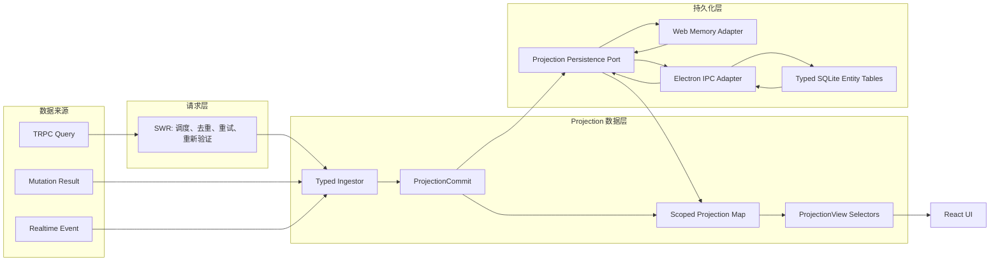
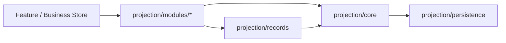
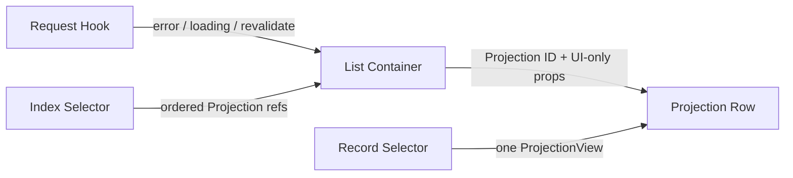
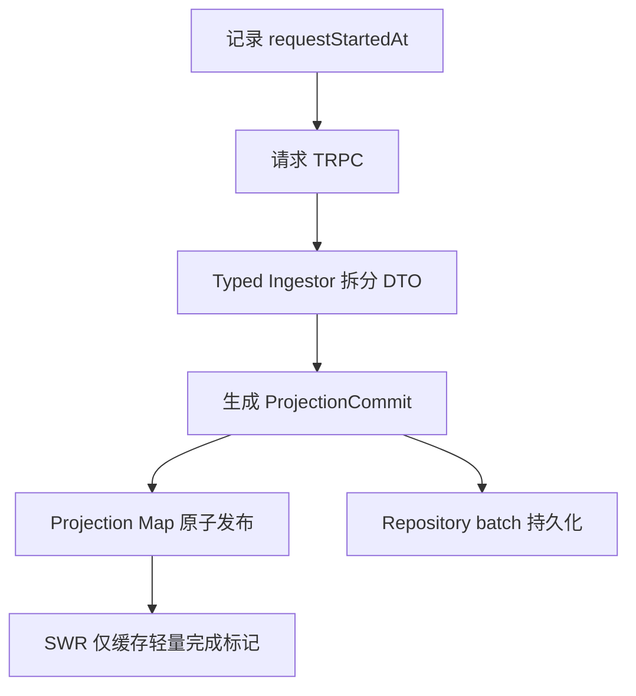
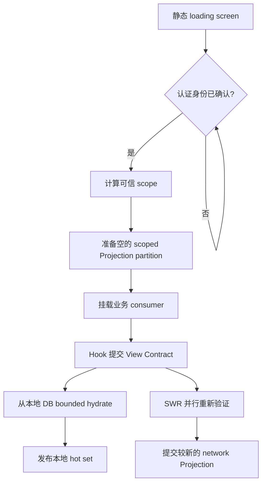

# Projection 客户端实体数据层规范

> 状态：Agent、ChatGroup、Topic、Task、Brief 与 Home 聚合读取已接入\
> 运行时后端：Web 进程内存 / Desktop typed SQLite Entity Cache\
> 迁移策略：Projection 为 canonical read source，既有 Zustand Store 由单向兼容桥接维持

## 1. 背景

当前客户端主要以 SWR key 为缓存单元。部分 SWR 响应被直接持久化，启动时再按 key
恢复；同一业务实体还可能同时出现在 SWR、多个 Zustand Store、列表响应和嵌套 DTO 中。
该结构存在四类系统性问题：

1. **持久化语义依赖请求形态**：请求参数或 key 变化后，旧数据无法自然迁移，也难以判断
   哪些 key 已被遗漏。
2. **同一实体存在多个可写副本**：例如 Agent 同时存在于侧栏列表、Brief 的嵌套快照和
   Task participant 中。更新一个副本不能保证其他副本同步。
3. **列表与实体混合**：列表响应既承担顺序和成员关系，又重复保存实体字段，导致列表刷新
   可以覆盖更晚的实体更新。
4. **局部响应缺少显式完整性**：不同接口返回同一实体的不同字段，但现有类型无法表达
   “当前对象对哪个 UI 契约已经完整”。

本规范将 SWR 限定为请求调度器，并建立以局部投影、fragment、索引和快照为核心的客户端数据层。
Projection 只表达客户端已经观测并建模的字段，不表示完整业务实体，也不取代服务端事实源。

## 2. 目标与非目标

### 2.1 目标

- 每个 scope 内，同一种业务身份只存在一个可写的 canonical `ProjectionRecord`。
- 完整 DTO、局部 DTO、mutation 结果和实时事件统一转换为 `ProjectionCommit`。
- fragment 以整体为最小替换单元，不执行无来源语义的 `merge(Partial<Entity>)`。
- 列表只持有实体引用、顺序、成员关系、查询签名和 coverage，不持有实体副本。
- `ProjectionView` 明确表示 “满足某个已声明 View Contract 的完整视图”。
- 持久化以业务数据模型为单位，不以 SWR key 为单位。
- 已登录 warm reload 在认证确认后可直接使用本地 Projection 数据，并在后台重新验证。
- account/workspace scope 严格隔离，未经认证确认不得展示持久化的私有数据。

### 2.2 非目标

- 本轮不替换服务端 PostgreSQL、TRPC 或领域 Repository。
- 本轮不把 `localDatabase` 变成离线写队列；服务端仍是最终事实来源。
- 本轮不迁移 Auth/User、Workspace member 与 Document 等尚未进入 Projection registry 的实体。
- 本轮不持久化任意 SWR response，也不建立 SWR key 到实体表的隐式映射。
- 本轮不改变 Daily Brief 的服务端语义、日期边界或刷新策略。

## 3. 术语

| 术语             | 定义                                                                                      |
| ---------------- | ----------------------------------------------------------------------------------------- |
| Entity           | 具有稳定逻辑身份的领域对象，例如 Agent、Topic、Task、Brief。                              |
| Entity Kind      | 实体类型，例如 `agent`、`topic`。ID 只在 kind 内唯一。                                    |
| Scope            | 数据隔离边界，格式为 `${userId}:${workspaceId \| personal \| account}`。                  |
| ProjectionRecord | scope 内某个 kind/id 的唯一局部 fragment 容器；不承诺表示完整实体。                       |
| Fragment         | 字段所有权明确、能够被至少一个来源整体替换的一组字段。                                    |
| Index            | 某一查询的成员关系、顺序和上下文元数据；仅保存引用。                                      |
| Snapshot         | 没有稳定实体身份，或其语义本身就是一次计算结果的数据。                                    |
| View Contract    | 某个消费界面声明的必需 fragments 集合。                                                   |
| ProjectionView   | 以一个 root ProjectionRecord 为主体，可组合引用记录，并满足某个 View Contract 的完整值。  |
| Aggregate View   | 覆盖当前 registry 已建模 fragments 的可选视图；仍不代表服务端完整实体。                   |
| ProjectionCommit | 一次原子内存变更，包含 fragment replacements、index/snapshot replacements 和 tombstones。 |

## 4. 总体架构



### 4.1 代码分层与依赖方向

Projection 是客户端已获取字段的 canonical 投影基础设施，不是完整业务实体仓库，也不是与
Home、Chat、Task 并列的业务 Store。代码放在独立的 `src/projection` 顶层目录：

```text
src/projection/
├── core/                 # scope、commit reducer、hydration、通用校验
├── records/              # canonical Projection action、selector、validator
├── modules/
│   ├── agent/            # Agent 详情、可用列表与搜索
│   ├── chat/             # Topic sidebar、agent view、搜索与分页
│   ├── chatGroup/        # ChatGroup 详情与列表
│   ├── task/             # Task 详情、平铺列表与分组列表
│   ├── brief/            # Brief news 列表
│   └── home/             # Home 聚合 Index、View selector、request hook
├── persistence/          # persistence port、Web memory、Electron codec/adapter
├── registry.ts           # 运行时适配器注册与稳定 forwarding facade
├── store.ts              # composition root；组合 core/records/modules
└── index.ts              # 面向消费者的公共入口

src/store/                # 各业务模块的 UI、交互和流程状态
packages/types/src/projection/
├── records/              # 按业务身份拆分的 fragments/records
└── modules/              # 按业务模块命名的 Index、Snapshot、View 类型
```

依赖必须遵守以下方向：



- `core` 不得依赖 Home、Chat、Task 等业务模块。
- concrete repository 由 composition root 注入 `core`；`core` 不得通过 persistence 反向加载
  任何业务 validator。
- canonical record 按实体命名，例如 `AgentProjection`、`TopicProjection`；不得使用
  `HomeAgentRecord` 之类的 feature-scoped 名称。
- Home 语义仅允许出现在 `home.*` Index、Home Snapshot、View Contract、Ingestor 和请求 Hook。
- `src/store/*` 可以向 Projection 提交 mutation commit，但不得成为 canonical Projection source。
- 新业务模块接入时扩展 Projection Record/Index/Snapshot registry，不创建第二个 projection map。

### 4.2 React 订阅边界

Projection Graph 的规范化不能止于 Store 内部；React 消费方式同样属于架构契约：



- 新增的 Projection-native Request Hook 只负责请求编排和 coverage 状态，不把响应 DTO 作为
  canonical 数据源。
- 已迁移的 UI 只能从 Projection selector 取实体值；不得在 Projection 缺失时回退到旧 Store、
  SWR response 或 fetcher DTO。缺少 coverage 应显示 loading /empty/error，而不是读取第二份实体值。
- 迁移中的既有 Hook 可以为兼容旧调用签名返回 DTO，但返回值必须以 Projection selector 覆盖，
  不能绕过 canonical record。
- 列表容器只订阅对应 Index，并向行组件传递 Projection ID/ref 与事件回调等 UI 参数。
- 行组件按 ID 订阅自己的 ProjectionRecord，并在本地组装对应 `ProjectionView`。
- 祖先组件不得把实体数组、完整 read model 或 ProjectionStore 实例作为 props 逐层传递。
- Selector 必须订阅所需的精确 Index、Record 或 fragment；不得为了组装一个列表而订阅整个
  `state.scopes[scope]`。
- Store 不保存预组装的 `ProjectionView[]`。Index、Record 更新后，Selector 是唯一的视图组装入口。
- Snapshot 的值本身是一个原子计算结果，可以由直接消费它的组件整体订阅；该例外不适用于
  具有稳定实体身份的集合。

该边界保证一个 Agent、ChatGroup、Topic、Task 或 Brief 更新时，Projection-native 组件只重新
渲染消费该记录的行。尚未迁移的旧组件由 `projectionLegacyBridge` 单向物化到既有 Store；该桥接
只用于兼容，不允许形成 Store → Projection → Store 的双向循环。

### 4.3 运行时职责

| 层               | 负责                                              | 不负责                           |
| ---------------- | ------------------------------------------------- | -------------------------------- |
| SWR              | 请求触发、in-flight 去重、重试、错误、重新验证    | canonical 数据、持久化、实体合并 |
| Ingestor         | 将具体 DTO 显式拆为 fragments、indexes、snapshots | 网络调度、UI 状态                |
| Projection Map   | scope 内唯一局部记录、commit 冲突处理、原子发布   | 远端事实存储、完整实体建模       |
| View Selector    | 检查 coverage 并组装不可写视图                    | 保存第二份 Projection 数据       |
| Persistence Port | 提供 commit、bounded hydrate、clear API           | 暴露 Web/Electron 分支给业务层   |
| Web Adapter      | 当前页面生命周期内的进程内存缓存                  | durable warm reload、离线事实源  |
| Electron Adapter | IPC codec、同 scope 写入排序                      | fragment 合并、UI 状态           |
| SQLite Entity DB | typed entity/index/snapshot 表、事务与约束        | 服务端事实存储、任意 KV          |

## 5. 身份与 scope

Projection record 的存储身份为：

```text
(scope, projectionKind, id)
```

- Personal scope：`${userId}:personal`。
- Workspace scope：`${userId}:${workspaceId}`。即使 workspace 相同，不同用户的成员视图仍需隔离。
- Account-wide 数据（当前为 Daily Brief）使用独立的 `${userId}:account` 分区，避免同一用户
  切换 workspace 时因为请求 key 不变而落入未填充的 workspace snapshot 分区，也避免为了
  一份 account snapshot 而加载完整 personal scope。
- Anonymous scope 不持久化 Home 私有 Projection。
- `lobehub:active-scope` 仅可用于提前定位候选分区，不能作为认证证明。
- Web 必须等待 auth session settled；Desktop 必须等待 `isUserStateInit`。只有确认后的 scope
  可以提交或展示私有 Projection 数据。Web hydration 通常为空；Desktop 可从实体表恢复。

## 6. ProjectionRecord 与 fragment 规则

概念类型如下：

```ts
interface ProjectionFragment<T> {
  data: T;
  observedAt: number;
  source: 'network' | 'mutation' | 'realtime';
}

interface ProjectionRecord<K extends string, F extends Record<string, unknown>> {
  fragments: { [P in keyof F]?: ProjectionFragment<F[P]> };
  id: string;
  kind: K;
  tombstoneAt?: number;
}
```

fragment 必须满足：

1. 至少有一个来源能够一次返回该 fragment 的全部字段。
2. 更新时整体替换，不对 fragment 内字段做通用 partial merge。
3. 如果某接口只能返回现有 fragment 的一部分，应拆出更小、所有权更明确的 fragment。
4. `undefined` 表示来源未覆盖；`null` 表示来源明确给出的空值，两者不可混用。
5. 完整 DTO 进入数据层时，必须由领域 Ingestor 拆为所有已建模 fragments；不得保留一份
   opaque raw DTO 作为并行事实来源。

## 7. 冲突与时序

每次请求在发出前通过进程内单调时钟记录 `observedAt`，而不是在响应返回后调用普通
`Date.now()`。单调值既保留 wall-clock 语义，也避免同一毫秒内 mutation 与重新验证产生相同
时间戳。fragment replacement 仅在以下条件之一成立时接受：

- 当前 fragment 不存在；
- incoming `observedAt` 大于当前值；
- 时间相等且来源优先级更高。

同一时间的来源优先级为：

```text
mutation > realtime > network
```

这样可以避免 “早发出的慢请求” 在 mutation 或实时事件之后返回，并把新状态覆盖为旧状态。
当服务端未来提供 revision/version 时，应优先比较服务端 revision；`observedAt` 是当前兼容策略。

删除以 tombstone 表达。早于 tombstone 的 fragment 或 index 响应不得复活实体；晚于 tombstone
且明确重新创建的响应可以替换 tombstone。

## 8. Index 与 Snapshot

### 8.1 Index

Index 只能保存：

- Projection refs；
- 有序成员关系；
- 分组关系；
- 查询签名；
- query-specific 元数据，例如 sidebar pin、unread count；
- coverage 和 `observedAt`。

Index 不得嵌入 Agent、Topic、Task 或 Brief 对象。成员被列表移除不等于 Projection 被删除。

### 8.2 Snapshot

以下数据保留为 snapshot：

- Daily Brief 推荐 pair；
- 推荐 feed；
- 其他一次计算结果且没有稳定实体 ID 的 payload。

Snapshot 仍然是 typed、versioned、scoped 的持久化对象，但不参与 Projection Map 去重。

## 9. ProjectionView 完整性

`ProjectionView` 不是 “数据库表所有字段的完整实体”，而是 “对一个声明过的 View Contract 完整”。

示例：

| View Contract          | 必需 fragments                                                                                 |
| ---------------------- | ---------------------------------------------------------------------------------------------- |
| `HomeSidebarAgentView` | Agent `identity`、`profile`、`access`、`routing`、`runtime` + sidebar index context            |
| `HomeRecentTopicView`  | Topic `display`、`activity`、`routing`、`navigation`                                           |
| `HomeInboxTopicView`   | Topic `display`、`activity`、`routing`、`status`、`runTiming`、`preview`                       |
| `HomeTaskCardView`     | Task `identity`、`display`、`description`、`lifecycle`                                         |
| `HomeBriefCardView`    | Brief `content`、`actions`、`readState`、`resolution`、`relations`；Agent/Task enrichment 可选 |

Selector 必须先验证必需 fragments。若缺失，返回未满足 coverage 的结果，不使用类型断言伪造完整
对象。对可选关联 Projection 缺失时，只能省略 enrichment，不能把整个主 Projection 判为不完整。

View Contract 同时是可执行的本地读取计划，而非仅用于文档的 fragment 清单。业务 Hook 提供查询
参数；Contract 声明 Index/Snapshot key，并根据已加载 Index 的 refs 计算 Record ID 与 fragments：

```ts
const agentDirectoryViewContract = {
  indexes: () => ['agent.directory'],
  records: (scope) => [
    projectionRecordRequest(
      'agent',
      projectionRefsFromIndex(scope?.indexes['agent.directory']).map((ref) => ref.id),
      ['access', 'identity', 'profile', 'runtime'],
    ),
  ],
};
```

Planner 先加载 Index，再根据 refs 补齐 Record；Brief relations、ChatGroup membership、Task
participants 等关联可在后续 pass 中继续解析。若目标数据已在 Projection Map 中，Planner 不访问
持久化层。相同 scope/view 的并发读取合并为一个 in-flight 操作。

## 10. 当前实体数据模型

### 10.1 Projection Records

| Kind      | Fragments                                                                                                                                                                                                      |
| --------- | -------------------------------------------------------------------------------------------------------------------------------------------------------------------------------------------------------------- |
| Agent     | `access`、`configuration`、`identity`、`knowledge`、`lifecycle`、`profile`、`routing`、`runtime`                                                                                                               |
| ChatGroup | `access`、`configuration`、`identity`、`lifecycle`、`membership`                                                                                                                                               |
| Topic     | `activity`、`analytics`、`completion`、`creation`、`details`、`display`、`generation`、`marking`、`navigation`、`ordering`、`ownership`、`preview`、`routing`、`runTiming`、`status`、`summary`、`triggerInfo` |
| Task      | `assignment`、`description`、`detail`、`display`、`identity`、`lifecycle`、`participants`、`row`                                                                                                               |
| Brief     | `actions`、`content`、`readState`、`relations`、`resolution`                                                                                                                                                   |

归一化规则如下：

- ChatGroup membership 中的 Agent 只保存 `ProjectionRef<'agent'>` 与关系字段
  `isSupervisor`，Agent 展示数据由 canonical Agent record 解析。
- Brief 响应中的嵌套 Agent 和 Task 分别写入 Agent/Task records；Brief 只保存关系 ID，View
  selector 再组装 enrichment。
- Task 的 Agent participant 只保存 Agent ref；用户 participant 在 UserProjection 建立前保留必要
  展示字段，不伪造不完整的 User 实体。
- 列表接口返回但尚未形成稳定 fragment 语义的 Task 字段进入 `row`；Task detail 的专属字段进入
  `detail`，二者仍由同一个 Task record 持有。

### 10.2 Indexes

| Index family             | 内容                                                                               |
| ------------------------ | ---------------------------------------------------------------------------------- |
| `agent.available`        | 当前运行上下文可用 Agent refs                                                      |
| `agent.directory`        | 群组成员选择与评测配置共用的完整 Agent 目录 refs                                   |
| `agent.search:*`         | 搜索结果中的 Agent/ChatGroup refs，以及 pin、unread、updatedAt 查询上下文          |
| `chatGroup.list`         | ChatGroup refs                                                                     |
| `chat.sidebarTopics:*`   | Chat sidebar 的 Topic refs、total、query signature 与分页持久化边界                |
| `chat.agentViewTopics:*` | Agent view 的 Topic refs、total、query signature 与分页持久化边界                  |
| `task.list:*`            | Task 平铺列表 refs、total 与 agent/visibility signature                            |
| `task.groupList:*`       | Task 分组列表 refs、group coverage、offset/limit/hasMore；不同页面以 agentKey 隔离 |
| `brief.news:*`           | 按日期查询的 Brief refs                                                            |
| `home.sidebar`           | pinned/private/grouped/ungrouped refs、folder 元数据、pin/unread 上下文            |
| `home.recentTopics`      | 有序 Topic refs，以及本次查询覆盖的 `limit`                                        |
| `home.inboxTopics`       | 有序 Topic refs，查询签名为 running + unread + last message                        |
| `home.tasks`             | 有序 Task refs、total、查询签名为 all agents + all visibility                      |
| `home.scheduledTasks`    | 自动化 Task refs 与 total；与普通 Home Tasks 结果集独立                            |
| `home.unresolvedBriefs`  | 有序 Brief refs                                                                    |

### 10.3 Snapshots

| Snapshot          | 语义                                                                 |
| ----------------- | -------------------------------------------------------------------- |
| `home.dailyBrief` | 存于 account scope；保持现有服务端返回与刷新语义，不增加本地日期 key |

### 10.4 尚未进入 canonical graph 的数据

| 数据                     | 原因与后续                                                                |
| ------------------------ | ------------------------------------------------------------------------- |
| Auth/User session        | 认证事实不能从本地实体缓存恢复；继续由 auth/user Store 管理               |
| Workspace member profile | 当前已有独立 workspace hook；后续迁移为 UserProjection + membership index |
| Recommendations          | 可作为独立 snapshot 接入，不是当前实体缓存正确性的阻塞项                  |
| Document recents         | 全局 Recents 迁移时加入 DocumentProjection                                |

## 11. Typed Repository 与物理布局

业务层只依赖 `ProjectionPersistence`，由 composition root 在首屏渲染前选择实现：

| Runtime  | 实现                            | 语义                                                     |
| -------- | ------------------------------- | -------------------------------------------------------- |
| Web      | `MemoryProjectionPersistence`   | 页面生命周期内可复用；刷新后允许重新加载，不写 IndexedDB |
| Electron | `ElectronProjectionPersistence` | 通过独立 IPC 写 typed SQLite；支持 durable warm reload   |

业务 Action、Selector、Ingestor 和组件禁止判断运行时。二者共同使用 `ProjectionCommit`、
Fragment 冲突规则与 hydration API，差异只存在于 persistence adapter 以下。

Electron 物理布局不是通用 KV，而是固定 registry 的实体 read model：

| SQLite table             | 主身份               | 固定内容                                           |
| ------------------------ | -------------------- | -------------------------------------------------- |
| `projection_agents`      | `(scope, entity_id)` | Agent registry 的 8 个 typed fragments             |
| `projection_chat_groups` | `(scope, entity_id)` | ChatGroup registry 的 5 个 typed fragments         |
| `projection_topics`      | `(scope, entity_id)` | Topic registry 的 17 个 typed fragments            |
| `projection_tasks`       | `(scope, entity_id)` | Task registry 的 8 个 typed fragments              |
| `projection_briefs`      | `(scope, entity_id)` | Brief registry 的 5 个 typed fragments             |
| `projection_indexes`     | `(scope, key)`       | 所有模块经 runtime registry 注册的 typed indexes   |
| `projection_snapshots`   | `(scope, key)`       | 所有模块经 runtime registry 注册的 typed snapshots |

每个实体 Fragment 对应固定的 `*_data / *_observed_at / *_source` 三列。SQLite 约束保证：

- 三列同时为空或同时存在；
- `observed_at >= 0`；
- source 只能为 `network / realtime / mutation`；
- data 是合法 JSON；
- schema version 固定为当前版本，Index/Snapshot key 不为空。

业务 key 与 Fragment 名称不在 SQLite `CHECK` 中重复枚举。`@lobechat/types` 中的 Projection
runtime registry 是唯一注册源：Renderer validator、Electron IPC 类型与 Main 进程边界校验共同消费
该 registry；SQLite 仅保护物理结构。新增 Index/Snapshot key 因此不构成数据库 schema 变化。

Fragment data 使用 SuperJSON 保留 Date 等结构化类型；hydration 后仍必须运行 Record、Index、
Snapshot 领域 validator，无效行按 cache miss 处理。一次 materialized commit 的实体、index、
snapshot 在同一 SQLite transaction 内 upsert；renderer 内同一 scope 的 IPC commit 保持调用
顺序，主进程再串行化共享 SQLite 连接上的所有写事务。

`hydrate(scope, request)` 必须携带明确的 Index key、Snapshot key，或 `kind + ids + fragments`。
Desktop 只查询请求中的 key/ID，并只向 renderer 返回请求中的 fragments；禁止在应用启动时扫描并
注入整个 scope。Task 路由使用业务 identifier，Desktop 查询同时解析 Task `entity_id` 与持久化
identity fragment，从而支持冷启动直接打开 `/task/:identifier`。

每个实体表的 Fragment 三元组和约束由同一 Fragment registry 生成，Desktop entity adapter registry
负责通用读写、hydrate、GC 与 inspection。Task identifier 查询作为 Task adapter 的显式扩展存在。
新增 Fragment 仍会增加物理列，因此必须新增 Desktop local migration；已发布 migration 不得修改，未发布
的 feature migration 应从最终 schema 重新生成。Entity Cache 仍是可重建 read model，不把旧的通用 KV
行反序列化为未验证的业务实体。

## 12. 请求与 SWR 协议

Projection-native 请求 hook 使用非持久化的 request key。迁移中的既有业务 hook 保持原有 API，
但其 DTO 只作为瞬时兼容值，最终返回值由 Projection selector 覆盖。Fetcher 流程如下：



约束：

- Projection-native UI 不读取 SWR response 作为事实数据源，只读取 ProjectionView selector。
- Projection-native 请求 Hook 在写入 Graph 后只向 SWR 返回轻量 request marker；迁移中的旧 Hook
  可以保留瞬时 DTO 返回形态，但必须从 canonical Projection 重新解析其实体字段。
- SWR error 表示本次重新验证失败；若 index 已 hydration，UI 保留 stale ProjectionView。
- `mutate()` 只负责重新触发请求，不负责手工维护实体副本。
- 已迁移的 Agent、ChatGroup、Topic、Task、Brief 与 Home request key 不加入 durable `CACHE_TIERS`。
- Provider hydration 只恢复当前仍属于持久化 tier 的 key；从 tier 移除的旧行会被清理，避免
  已退役的实体 DTO 在后续启动中继续进入 SWR 内存。

## 13. 启动、hydration 与 scope 切换

首次启动与页面进入顺序：



- Global Gate 只确认身份并准备 scope，不读取任何实体、Index 或 Snapshot。
- “需要加载什么” 由挂载业务面的 View Contract 决定，不由全局白名单、组件手写 DB 查询或
  Zustand 当前内容猜测。
- 本地 hydrate 与远端重新验证并行；二者进入相同 reducer，`observedAt` 与 source priority 保证
  较旧缓存不能覆盖较新的 network/mutation/realtime commit。
- 本地 hydrate 失败按 cache miss 处理并依赖网络恢复，不能永久阻塞应用。
- Web adapter 不承诺跨刷新 hydration；Electron adapter 从 typed SQLite 表按需恢复。
- Zustand 只包含当前会话实际访问过的 Index、Record 与 fragments；SQLite 可以保留完整 durable
  read model。进入某个 View 不会把该 scope 的其他表或其他实体一并注入内存。
- hydration 得到的空 index 仍表示 “已初始化且结果为空”；index 缺失才表示从未取得 coverage。
- scope 切换不得展示前一 scope 的数据。Selector 始终显式接收当前 scope。
- 已在内存准备完成的目标 scope 可立即切换。
- 尚未准备完成时，当前实现只允许目标 Home surface 显示局部 loading；后续 workspace
  切换控制器应采用 `prepare(target) -> commit active workspace` 的两阶段协议，从而消除此窗口。

## 14. Mutation 与实时事件

Mutation 不得分别 patch SWR、Zustand list 和组件本地状态。统一流程为：

1. 构造 mutation `ProjectionCommit`，替换明确 fragment 或 index。
2. 原子更新 Projection Graph，并写入 typed repository。
3. 发起服务端 mutation。
4. 成功后按返回值提交 authoritative commit，或触发对应 request revalidation。
5. 失败时以 inverse commit 回滚，或重新读取服务端事实。

当前已接入的更新路径包括：

- Agent config/meta 更新、创建结果与删除；
- ChatGroup detail/item 更新与删除；
- Topic title、status、metadata、集合更新与删除；
- Task name、status、detail 与删除；
- Brief read、resolve 与删除；
- Home inbox 的 `promoteToRunning` 与 Recent Topic/Task 标题更新；
- DevDock 对可变 fragment 字段的编辑。

业务 mutation 仍负责向服务端提交事实。Projection mutation commit 用于即时 UI 反馈；失败时由
现有业务 action 回滚或重新验证。DevDock 是开发环境的本地 read-model 编辑器，不会把修改上传到
服务端。

## 15. Projection 与业务 Store 的迁移边界

Projection Graph 已成为 Agent、ChatGroup、Topic、Task、Brief 与 Home 聚合数据的 canonical
client read source。既有 Store 按以下原则过渡：

- 业务 action 的公开签名、loading/error、编辑状态和流程状态保持不变，业务组件不需要判断 Web
  或 Electron。
- 网络 DTO 先进入 typed Ingestor，再从 Projection selector 解析为旧 Store 所需的 read model。
- `projectionLegacyBridge` 订阅 Projection commit，并将可见记录单向物化到 AgentStore、
  AgentGroupStore、ChatStore、TaskStore、BriefStore；因此 DevDock 编辑可以反映到尚未迁移的 UI。
- 旧 Store 不向 SWR 或 Projection 执行自动反向镜像。业务 mutation action 是唯一允许同时更新
  服务端与 Projection 的边界，避免订阅循环。
- SWR/localStorage/IndexedDB 不再持久化这些实体 DTO。Web 只保留当前页面内存；Electron 的
  Projection typed SQLite 是唯一 durable client entity cache。
- 后续组件迁移到 Projection-native selectors 后，应删除对应的旧 Store read-model 字段与桥接分支；
  流程状态仍可保留在业务 Store。

## 16. 错误、加载与 stale 语义

| 本地 coverage                  | 网络状态     | UI 行为                                     |
| ------------------------------ | ------------ | ------------------------------------------- |
| 有完整 index/view              | 请求中或失败 | 立即显示 stale data；错误为非阻塞刷新错误   |
| 有空 index                     | 请求中或失败 | 显示真实 empty state，不显示 skeleton       |
| 无 index                       | 请求中       | 显示首次加载状态                            |
| 无 index                       | 请求失败     | 显示可重试错误                              |
| index 存在但必需 fragment 缺失 | 任意         | 视为本地数据损坏；不伪造 view，触发重新验证 |

## 17. GC、容量与隐私

- Index replacement 不立即删除未引用 Projection，因为其他 index 可能仍引用它。
- Tombstone 和长期无引用 Projection 由后续 GC 清理；首版允许保留，以正确性优先。
- GC 必须按 scope 执行，并在删除前计算所有 index refs。
- logout/expired session 后不展示旧 scope；保留的分区数据只能在同一用户再次认证后读取。
- 不将 auth token、cookie、provider credential 或完整用户设置写入 Projection 层。

## 18. 测试要求

### 18.1 纯逻辑测试

- DTO 被拆为预期 fragments，嵌套 Agent/Task 不保留在 Brief 中。
- ChatGroup membership 与 Task Agent participant 只保留 refs，修改 canonical Agent 后所有关联
  View 同步更新。
- 开放 JSON 字段和服务端宽类型在 Ingestor 边界完成运行时校验，错误 DTO 不进入 graph。
- 同 kind/id 的多个来源只产生一个 ProjectionRecord。
- index 只保存 refs，不保存 Projection 对象。
- 带参数的 index 必须验证 coverage；较小的 recent-topic `limit` 不满足较大的 View 请求。
- 早请求晚返回不能覆盖更晚 mutation。
- tombstone 阻止旧响应复活 Projection。
- ProjectionView 缺 fragment 时不返回伪完整对象。

### 18.2 Repository 测试

- Web memory adapter 的 scope 隔离与刷新后网络兜底语义。
- bounded hydrate 只返回请求的 Index/Snapshot、实体 ID 与 fragments；Index-first planner 只追踪
  当前 View refs。
- Electron record/index/snapshot 在一个 SQLite transaction 中写入。
- 同一 scope 的多个 durable commit 保持调用顺序；共享 SQLite 连接上的事务不交错。
- Date 等 structured-clone/superjson 类型可往返。
- SQLite 拒绝不完整 Fragment 三元组、非法 source/key/schema version。
- 未知或无效持久化数据被忽略。
- hydration 能区分空 index 与缺失 index；Task identifier 可在冷启动时解析为持久化 entity row。

### 18.3 集成测试

- auth 未确认时不渲染旧用户 Home 数据。
- warm reload 在远端请求完成前即可得到按需 hydration 的 Home view。
- account/workspace 切换不显示前一个 scope。
- stale data 存在时重新验证失败不退回 skeleton。
- Agent/ChatGroup/Topic/Task/Brief mutation 后，Projection-native View 与旧业务 Store 在同一
  commit 后得到一致结果。
- DevDock 修改可变 fragment 后，兼容桥接驱动现有 UI 更新；scope、id、source、observedAt 等
  immutable 字段不可编辑。
- Desktop 旧 schema 可升级到新 typed tables，旧 fragments 保留，新增 fragments 为 `NULL`。

## 19. 业务接入矩阵

| 业务模块  | 已接入读取面                                                                     | Canonical 结果                                                           |
| --------- | -------------------------------------------------------------------------------- | ------------------------------------------------------------------------ |
| Agent     | config/hydrate、available、directory、search、builtin、prefetch、profile/preview | Agent records + `agent.available` / `agent.directory` / `agent.search:*` |
| ChatGroup | detail、list、sidebar/search                                                     | ChatGroup/Agent records + `chatGroup.list` / mixed search refs           |
| Topic     | sidebar、agent view、search、pagination、Home recents/inbox                      | Topic records + `chat.*` / `home.*Topics` indexes                        |
| Task      | detail、平铺列表、Agent sidebar、Goals page、Home tasks/scheduled/goals          | Task/Agent records + `task.list:*` / `task.groupList:*` / Home           |
| Brief     | unresolved、news、read/resolve/delete                                            | Brief/Agent/Task records + `brief.news:*` / `home.unresolvedBriefs`      |
| Home      | sidebar、recents、inbox、tasks、scheduled tasks、goals、briefs、daily brief      | 6 个 Home indexes、Goals task group index + `home.dailyBrief` snapshot   |

上述 Hook 的 SWR 仅承担请求生命周期。Projection-native Home Hook 返回 request marker；为了兼容旧
调用者，部分既有 Hook 仍返回由 Projection 重新解析的瞬时 read model，但不进入 durable SWR tier。

## 20. 验收标准

本阶段完成必须同时满足：

1. Agent、ChatGroup、Topic、Task、Brief 与 Home 已列出的读取面均先提交 Projection，并从
   canonical selector 得到返回值。
2. 对应 SWR key 不进入 durable tier；Web 刷新后允许重新加载，Electron 根据挂载 View Contract
   从 typed SQLite bounded hydrate，启动时不扫描整个 scope。
3. 每个实体在同一 scope/kind/id 下只有一个 canonical record；列表与关系只保存 refs。
4. Brief enrichment、ChatGroup membership、Task Agent participant 均从 canonical records 解析。
5. request-start 单调时间戳、mutation 优先级与 tombstone 阻止慢响应回滚或复活旧数据。
6. 既有业务 Store API 和 UI 行为保持不变；兼容桥接只允许 Projection → Store 单向物化。
7. DevDock 可编辑字段实时反馈到 Projection-native 与旧业务 UI；immutable 字段保持只读。
8. Desktop 已发布 migration 保留旧 fragments，并以 `NULL` 初始化新增列；约束与 hydration validator 生效。
9. warm reload、空结果、刷新失败、scope/account switch 的行为测试通过。
10. `src/projection/core` 不依赖具体业务模块；所有模块通过 composition root 接入同一 graph。
11. Zustand 中不存在未被已挂载 View 请求的全 scope 实体灌入；Index-first 与关联 follow-up 的
    行为测试通过。
